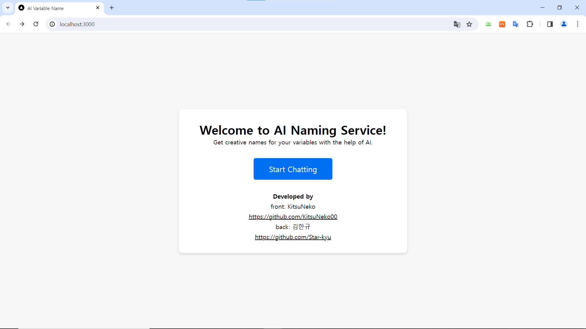
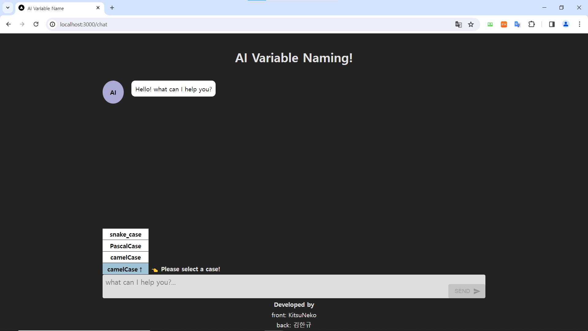
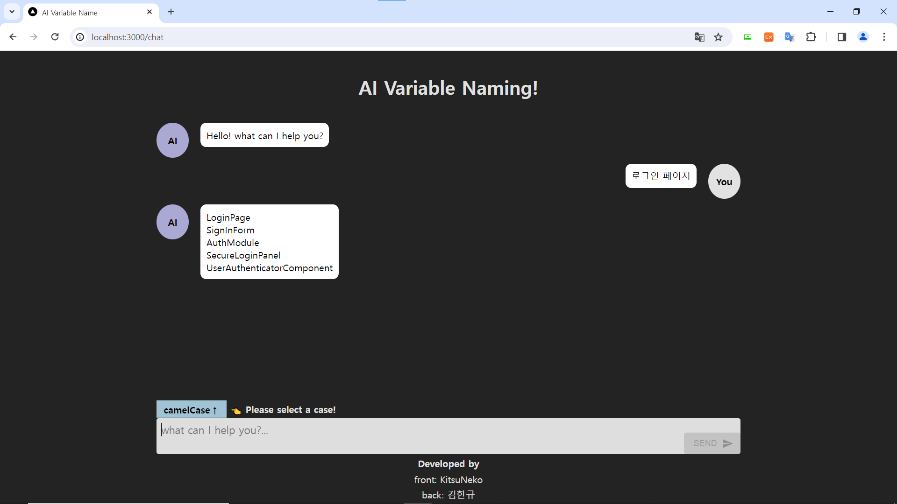

## AI-Variable-Name
개발자들을 위한, 변수를 작명해주는 간단한 인공지능 채팅 서비스입니다.
 
ChatGpt의 API를 이용하여 프로젝트를 진행하였으며, 
 
반응형 디자인으로 제작하였습니다.

링크: https://scintillating-phoenix-b0cf78.netlify.app/

## 초기 화면

## 채팅방 화면

case를 선택하여 필요한 변수를 입력합니다.
 
camelCase, PascalCase, snake_case를 선택할 수 있습니다.

## 결과

## Tech Stack
1. Next.Js
2. Typescript
3. MUI
